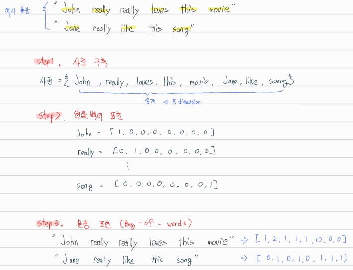
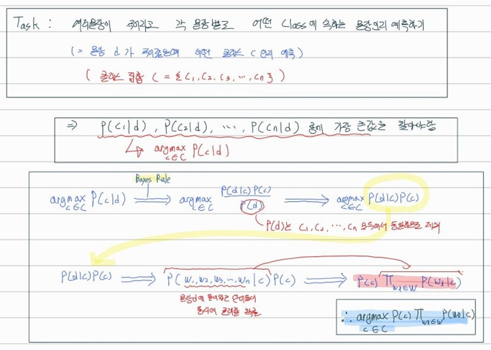
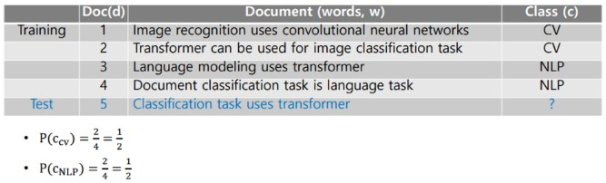
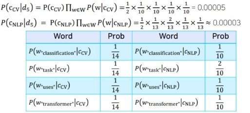
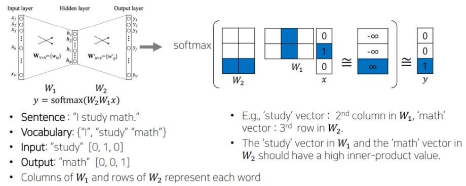
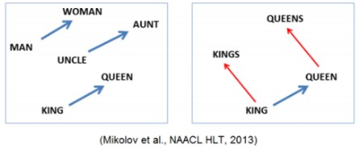
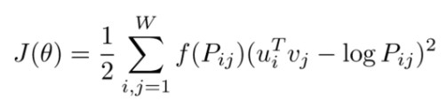

## Table of Contents

- 

---

## #1

### Bag-of-words 와 NaiveBayes Classifier
- Bag-of-words : 딥러닝 기술이 적용되기 이전에 많이 활용되던 단어 및 문서를 숫자 형태로 나타내는 가장 간단한 기법
    - Bag-of-words 과정
        1. 텍스트 데이터셋에서 unique한 word들을 모아서 vocabulary(사전)을 구축
        2. 사전에 단어 개수가 n개라면 n dimension의 벡터를 만들고, 각 단어에 해당하는 값은 1, 나머지는 0으로 표현(원핫벡터)
        (원핫벡터는 워드 임베딩 기법과 대비되는 특성으로 어떤 단어쌍이든 모두 유클리드 거리가 루트2로 표현되고 내적값 혹은 내적 코사인유사도는 0으로 모두 동일하게 계산됨 -> 즉 단어의 의미와 상관없이 모두가 동일한 관계를 가지는 형태로 단어 표현)
        3. 문장에 있는 단어들의 원핫벡터를 모두 더하여 문장 표현
        (즉, 단어들을 Bag에 넣는다고 생각)
    - Bag-of-words 예시    
        
- NaiveBayes Classifier : Bag-of-words를 활용한 대표적인 문서 분류 기법
    - 이론    
        
    - 예시    
        
        

#### References
- [boostcamp AI Tech](https://boostcamp.connect.or.kr/program_ai.html)

---

## #2

### Word Embedding(Word2Vec, Glove)
- Word Embedding의 기본 아이디어는 비슷한 의미를 가지는 단어가 좌표공간상에 비슷한 위치의 점으로 매핑 되도록 함으로써 의미상의 유사도를 잘 반영한 벡터 표현을 만들도록 해줌
- Word2Vec
    - 한 단어가 주변에 등장하는 단어를 통해 그 의미를 알 수 있다는 점에서 착안
    - Word2Vec 과정 (예시 문장 : `I study math`)
        1. 문장에서 unique한 단어를 추출하여 사전 구축(one-hot vector)
        2. 문장에서 입출력 순서쌍 구하기(Skip-gram적용, (여기선 window size = 3 으로 설정(앞,자기자신,뒤)))
            - 입출력 쌍 : (I,study) // (study,I), (study,math) // (math,study)
        3. 입출력 레이어의 노드 수는 사전의 사이즈와 같음 (여기선 문장의 단어수가 3개이므로 vocabulary size = 3)
        4. 입출력 순서쌍 사이에 두개의 입출력 레이어와 소프트맥스를 넣고 학습 진행(vocabulary size 차원 -> vocabulary size 보다 작은 차원 -> vocabulary size 차원)
        
        (우리는 이 중에서 input 단어가 들어갔을때 W1을 거쳐 hidden layer에 존재하는 벡터를 임베딩 벡터로 사용)
    - Property of Word2Vec
        - 단어들 사이에 관계를 표현해보면 비슷한 관계는 같은 벡터를 가짐
            
- GloVe
    - Word2Vec과 더불어 많이 쓰이는 워드 임베딩 방법
    - Glove 과정
        - 각 입출력 단어 쌍들에 대해 그 학습 데이터에서 그 두 단어가 한 윈도우 내에서 총 몇 번 동시에 등장했는지를 사전에 미리 계산 ($P_(ij)$)
        - 입력워드의 임베딩 벡터 $u_i$ 와 출력워드의 임베딩 벡터 $v_j$의 내적값이 한 윈도우 안에서 두 단어가 동시에 나타난 횟수인 $P_(ij)$에 가까워질 수 있도록 학습 진행함
    - Glove 수식    
        
#### References
- [boostcamp AI Tech](https://boostcamp.connect.or.kr/program_ai.html)