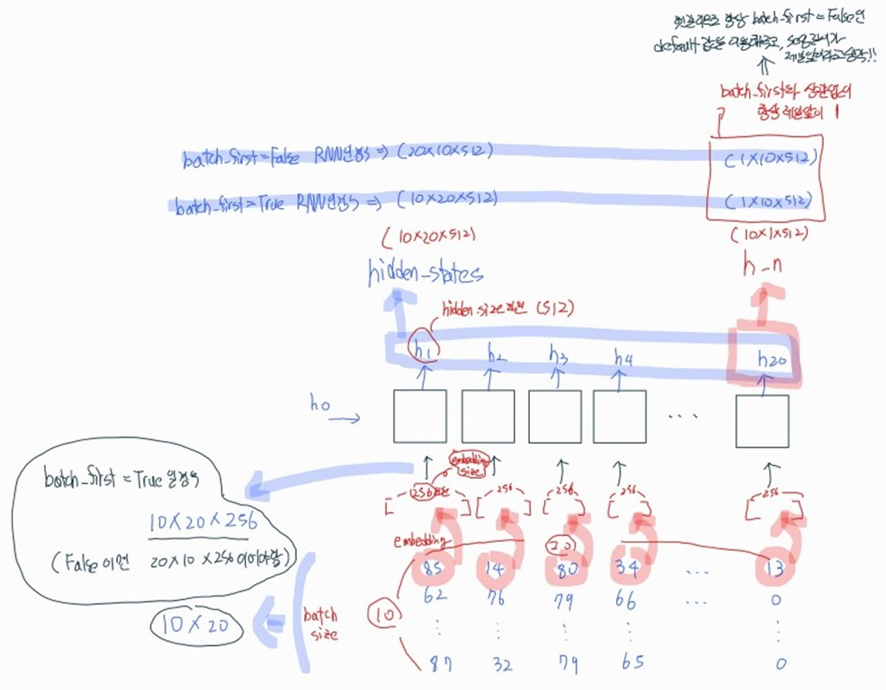

## Table of Contents

- [Bag-of-words 와 NaiveBayes Classifier](#1)
- [Word Embedding(Word2Vec, Glove)(cf. CBOW, Skip-gram)](#2)
- [RNN(Recurrent Neural Network)](#3)
- [LSTM(Long Short-Term Memory), GRU(Gated Recurrent Unit)](#4)
---

## #1

### Bag-of-words 와 NaiveBayes Classifier
- Bag-of-words : 딥러닝 기술이 적용되기 이전에 많이 활용되던 단어 및 문서를 숫자 형태로 나타내는 가장 간단한 기법
    - Bag-of-words 과정
        1. 텍스트 데이터셋에서 unique한 word들을 모아서 vocabulary(사전)을 구축
        2. 사전에 단어 개수가 n개라면 n dimension의 벡터를 만들고, 각 단어에 해당하는 값은 1, 나머지는 0으로 표현(원핫벡터)
        (원핫벡터는 워드 임베딩 기법과 대비되는 특성으로 어떤 단어쌍이든 모두 유클리드 거리가 루트2로 표현되고 내적값 혹은 내적 코사인유사도는 0으로 모두 동일하게 계산됨 -> 즉 단어의 의미와 상관없이 모두가 동일한 관계를 가지는 형태로 단어 표현)
        3. 문장에 있는 단어들의 원핫벡터를 모두 더하여 문장 표현
        (즉, 단어들을 Bag에 넣는다고 생각)
    - Bag-of-words 예시    
        
- NaiveBayes Classifier : Bag-of-words를 활용한 대표적인 문서 분류 기법
    - 이론    
        
    - 예시    
        
        
  

#### References
- [boostcamp AI Tech](https://boostcamp.connect.or.kr/program_ai.html)

---

## #2

### Word Embedding(Word2Vec, Glove)(cf. CBOW, Skip-gram)
- Word Embedding의 기본 아이디어는 비슷한 의미를 가지는 단어가 좌표공간상에 비슷한 위치의 점으로 매핑 되도록 함으로써 의미상의 유사도를 잘 반영한 벡터 표현을 만들도록 해줌
- CBOW와 Skip-gram
    - CBOW(Continuous Bag-of-Words)
        - 주변 단어들을 가지고 중심 단어를 예측하는 방식
        - 예시
            - **A cute puppy is walking** in the park. & window size: 2
                - Input(주변 단어): "A", "cute", "is", "walking"
                - Output(중심 단어): "puppy"
    - Skip-gram
        - 중심 단어를 가지고 주변 단어들을 예측하는 방식
        - 예시
            - **A cute puppy is walking** in the park. & window size: 2
                - Input(중심 단어): "puppy"
                - Output(주변 단어): "A", "cute", "is", "walking"
    - CBOW는 입출력 쌍이 (윈도우내 주변단어 전체,중심단어)(즉, (2*windowsize,1) 크기)이고, Skip-gram은 입출력 쌍이 (주변단어1개,중심단어)(즉, (1,1) 크기)로 이루어져있음(CBOW는 모든 입력쌍이 임베딩 된 후에 sum을 통해 합쳐줌)
- Word2Vec
    - 한 단어가 주변에 등장하는 단어를 통해 그 의미를 알 수 있다는 점에서 착안
    - Word2Vec 과정 (예시 문장 : `I study math`)
        1. 문장에서 unique한 단어를 추출하여 사전 구축(one-hot vector)
        2. 문장에서 입출력 순서쌍 구하기(Skip-gram적용, (여기선 window size = 3 으로 설정(앞,자기자신,뒤)))
            - 입출력 쌍 : (I,study) // (study,I), (study,math) // (math,study)
        3. 입출력 레이어의 노드 수는 사전의 사이즈와 같음 (여기선 문장의 단어수가 3개이므로 vocabulary size = 3)
        4. 입출력 순서쌍 사이에 두개의 입출력 레이어와 소프트맥스를 넣고 학습 진행(vocabulary size 차원 -> vocabulary size 보다 작은 차원 -> vocabulary size 차원)    
        

        (우리는 이 중에서 input 단어가 들어갔을때 W1을 거쳐 hidden layer에 존재하는 벡터를 임베딩 벡터로 사용)
    - Property of Word2Vec
        - 단어들 사이에 관계를 표현해보면 비슷한 관계는 같은 벡터를 가짐    
            

- GloVe
    - Word2Vec과 더불어 많이 쓰이는 워드 임베딩 방법
    - GloVe는 어떠한 단어쌍이 동시에 등장하는 횟수를 미리 계산해서 중복되는 계산을 줄여줄수 있다는 장점이 존재하여 상대적으로 더 빠르고 더 적은 데이터에 대해서도 더 잘 동작하는 특성을 보임
    - Glove 과정
        - 각 입출력 단어 쌍들에 대해 그 학습 데이터에서 그 두 단어가 한 윈도우 내에서 총 몇 번 동시에 등장했는지를 사전에 미리 계산 $P_{ij}$
        - 입력워드의 임베딩 벡터 $u_i$ 와 출력워드의 임베딩 벡터 $v_j$의 내적값이 한 윈도우 안에서 두 단어가 동시에 나타난 횟수인 $P_{ij}$에 가까워질 수 있도록 학습 진행함
    - Glove 수식    
        

- Word2Vec 실습 (+ CBOW, SkipGram)
    - 실습 데이터
        ```python
        train_data = [
        "정말 맛있습니다. 추천합니다.",
        "기대했던 것보단 별로였네요.",
        "다 좋은데 가격이 너무 비싸서 다시 가고 싶다는 생각이 안 드네요.",
        "완전 최고입니다! 재방문 의사 있습니다.",
        "음식도 서비스도 다 만족스러웠습니다.",
        "위생 상태가 좀 별로였습니다. 좀 더 개선되기를 바랍니다.",
        "맛도 좋았고 직원분들 서비스도 너무 친절했습니다.",
        "기념일에 방문했는데 음식도 분위기도 서비스도 다 좋았습니다.",
        "전반적으로 음식이 너무 짰습니다. 저는 별로였네요.",
        "위생에 조금 더 신경 썼으면 좋겠습니다. 조금 불쾌했습니다."       
        ]

        test_words = ["음식", "맛", "서비스", "위생", "가격"]
        ```
    - 데이터를 Tokenization을 진행한 후에 token 별로 embedding에 집어넣기 위한 숫자로 변경시켜주기(token id화 시켜주기)
        ```python
        from konlpy.tag import Okt
        from collections import defaultdict

        tokenizer = Okt()

        def make_tokenized(data):
            tokenized = []
            for sent in data:
                tokens = tokenizer.morphs(sent, stem=True)
                tokenized.append(tokens)

            return tokenized

        train_tokenized = make_tokenized(train_data) # [['정말', '맛있다', '.', '추천', '하다', '.'], ['기대하다', '것', '보단', '별로', '이다', '.'], ...]

        word_count = defaultdict(int)

        for tokens in train_tokenized:
            for token in tokens:
                word_count[token] += 1
        
        w2i = {}
        for pair in word_count:
            if pair[0] not in w2i:
                w2i[pair[0]] = len(w2i)

        print(w2i)
        '''
        {'.': 0, '도': 1, '이다': 2, '좋다': 3, '별로': 4, '다': 5, '이': 6, '너무': 7, '음식': 8, '서비스': 9, '하다': 10, '방문': 11, '위생': 12, '좀': 13, '더': 14, '에': 15, '조금': 16, '정말': 17, '맛있다': 18, '추천': 19, '기대하다': 20, '것': 21, '보단': 22, '가격': 23, '비싸다': 24, '다시': 25, '가다': 26, '싶다': 27, '생각': 28, '안': 29, '드네': 30, '요': 31, '완전': 32, '최고': 33, '!': 34, '재': 35, '의사': 36, '있다': 37, '만족스럽다': 38, '상태': 39, '가': 40, '개선': 41, '되다': 42, '기르다': 43, '바라다': 44, '맛': 45, '직원': 46, '분들': 47, '친절하다': 48, '기념일': 49, '분위기': 50, '전반': 51, '적': 52, '으로': 53, '짜다': 54, '저': 55, '는': 56, '신경': 57, '써다': 58, '불쾌하다': 59}
        '''
    - CBOW Dataset 과 SkipGram Dataset 생성 (실제 embedding 모델에 들어가기 위한 input과 output 쌍 생성)
        - CBOW Dataset
            ```python
            class CBOWDataset(Dataset):
                def __init__(self, train_tokenized, window_size=2):
                    self.x = []
                    self.y = []

                    for tokens in tqdm(train_tokenized):
                        # token_ids 는 한 문장 안에 있는 token들의 id 리스트
                        token_ids = [w2i[token] for token in tokens]
                        for i, id in enumerate(token_ids):
                            if i-window_size >= 0 and i+window_size < len(token_ids): # 범위 안에 있는것들만 가져온다.
                                self.x.append(token_ids[i-window_size:i] + token_ids[i+1:i+window_size+1]) # 주변단어 4개
                                self.y.append(id) # 중심단어 1개

                    self.x = torch.LongTensor(self.x)  # (전체 데이터 개수 * 2 * window_size)
                    self.y = torch.LongTensor(self.y)  # (전체 데이터 개수)

                def __len__(self):
                    return self.x.shape[0]

                def __getitem__(self, idx):
                    return self.x[idx], self.y[idx]
            ```
        - SkipGram Dataset
            ```python
            class SkipGramDataset(Dataset):
                def __init__(self, train_tokenized, window_size=2):
                    self.x = []
                    self.y = []

                    for tokens in tqdm(train_tokenized):
                        token_ids = [w2i[token] for token in tokens]
                        for i, id in enumerate(token_ids):
                            if i-window_size >= 0 and i+window_size < len(token_ids):
                                self.y += (token_ids[i-window_size:i] + token_ids[i+1:i+window_size+1])
                                self.x += [id] * 2 * window_size

                    self.x = torch.LongTensor(self.x)  # (전체 데이터 개수 * 2 * window_size)
                    self.y = torch.LongTensor(self.y)  # (전체 데이터 개수 * 2 * window_size)

                def __len__(self):
                    return self.x.shape[0]

                def __getitem__(self, idx):
                    return self.x[idx], self.y[idx]
            ```
        - Dataset 생성
            ```python
            cbow_set = CBOWDataset(train_tokenized)
            skipgram_set = SkipGramDataset(train_tokenized)
            print(list(cbow_set)[:5])
            print()
            print(list(skipgram_set)[:5])
            print()
            print(len(cbow_set))
            print(len(skipgram_set))
            '''
            [(tensor([17, 18, 19, 10]), tensor(0)), (tensor([18,  0, 10,  0]), tensor(19)), (tensor([20, 21,  4,  2]), tensor(22)), (tensor([21, 22,  2,  0]), tensor(4)), (tensor([5, 3, 6, 7]), tensor(23))]

            [(tensor(0), tensor(17)), (tensor(0), tensor(18)), (tensor(0), tensor(19)), (tensor(0), tensor(10)), (tensor(19), tensor(18))]

            64
            256
            '''
            ```
    - Word2Vec 모델
        - CBOW Word2Vec 모델
            ```python
            class CBOW(nn.Module):
                def __init__(self, vocab_size, dim):
                    super(CBOW, self).__init__()
                    self.embedding = nn.Embedding(vocab_size, dim, sparse=True)
                    self.linear = nn.Linear(dim, vocab_size)

                # B: batch size, W: window size, d_w: word embedding size, V: vocab size
                def forward(self, x):  # x: (B, 2W)
                    embeddings = self.embedding(x)  # (B, 2W, d_w)
                    embeddings = torch.sum(embeddings, dim=1)  # (B, d_w)
                    output = self.linear(embeddings)  # (B, V)
                    return output
                
            cbow = CBOW(vocab_size=len(w2i), dim=256)
            ```
        - SkipGram Word2Vec 모델
            ```python
            class SkipGram(nn.Module):
                def __init__(self, vocab_size, dim):
                    super(SkipGram, self).__init__()
                    self.embedding = nn.Embedding(vocab_size, dim, sparse=True)
                    self.linear = nn.Linear(dim, vocab_size)

                # B: batch size, W: window size, d_w: word embedding size, V: vocab size
                def forward(self, x): # x: (B)
                    embeddings = self.embedding(x)  # (B, d_w)
                    output = self.linear(embeddings)  # (B, V)
                    return output
                
            skipgram = SkipGram(vocab_size=len(w2i), dim=256)
            ```
    - 학습 진행
        - CBOW Word2Vec 모델 학습
            ```python
            batch_size=4
            learning_rate = 5e-4
            num_epochs = 5
            device = torch.device('cuda') if torch.cuda.is_available() else torch.device('cpu')

            cbow_loader = DataLoader(cbow_set, batch_size=batch_size)

            cbow.train()
            cbow = cbow.to(device)
            optim = torch.optim.SGD(cbow.parameters(), lr=learning_rate)
            loss_function = nn.CrossEntropyLoss()

            for e in range(1, num_epochs+1):
                print("#" * 50)
                print(f"Epoch: {e}")
                for batch in tqdm(cbow_loader):
                    x, y = batch
                    x, y = x.to(device), y.to(device) # (B, 2*W), (B)
                    output = cbow(x)  # (B, V)

                    optim.zero_grad()
                    loss = loss_function(output, y)
                    loss.backward()
                    optim.step()

                    print(f"Train loss: {loss.item()}")

            print("Finished.")
            ```
        - SkipGram Word2Vec 모델 학습
            ```python
            batch_size=4
            learning_rate = 5e-4
            num_epochs = 5
            device = torch.device('cuda') if torch.cuda.is_available() else torch.device('cpu')

            skipgram_loader = DataLoader(skipgram_set, batch_size=batch_size)

            skipgram.train()
            skipgram = skipgram.to(device)
            optim = torch.optim.SGD(skipgram.parameters(), lr=learning_rate)
            loss_function = nn.CrossEntropyLoss()

            for e in range(1, num_epochs+1):
                print("#" * 50)
                print(f"Epoch: {e}")
                for batch in tqdm(skipgram_loader):
                    x, y = batch
                    x, y = x.to(device), y.to(device) # (B), (B)
                    output = skipgram(x)  # (B, V)

                    optim.zero_grad()
                    loss = loss_function(output, y)
                    loss.backward()
                    optim.step()

                    print(f"Train loss: {loss.item()}")

            print("Finished.")
            ```
    - test 단어들의 word embedding 확인
        - 모델.embedding을 이용하여 단어의 embedding을 확인
        ```python
        for word in test_words:
            input_id = torch.LongTensor([w2i[word]]).to(device)
            emb = cbow.embedding(input_id)

            print(f"Word: {word}")
            print(emb.squeeze(0))
        ```
        ```python
        for word in test_words:
            input_id = torch.LongTensor([w2i[word]]).to(device)
            emb = skipgram.embedding(input_id)

            print(f"Word: {word}")
            print(emb.squeeze(0))
        ```

#### References
- [boostcamp AI Tech](https://boostcamp.connect.or.kr/program_ai.html)

---

## #3

### RNN(Recurrent Neural Network)
- RNN 종류    
    
- RNN 기본 구조    
    
- RNN 연산 과정    
    
- RNN many-to-many 학습 추론 과정 예시
    - hello 단어를 통한 설명
    - 학습과정    
        
    - 추론과정
        - h라는 문자열 하나가 들어가게 되면 h의 결과값 y가 다음 input으로 들어가게 되고 또 다시 그 input의 결과값이 다시 다음 input으로 들어가게 됨    
        
- Backpropagation through time (BPTT)
    - 각 타임 스텝마다 예측값과 실제값의 비교를 통한 loss function을 통해서 전체 네트워크가 학습을 진행됨 -> 전체 시퀀스의 길이가 길어지게 되면 메모리 문제등으로 인하여 학습이 어려워짐
    - 실제 한번 학습을 진행하기 위해서는 하나의 입력의 output을 구하고 그 output과 입력을 통해서 다시 output을 구하고 이런식으로 모든 output을 구하게 되면 마지막 타임스텝쯤에는 제일 처음의 타임 스텝부터 동일한 matrix가 매 타임 스텝마다 곱해지게 되면서 메모리 문제가 발생할수 있음 또는 Vanishing/Exploding Gradient Problem 발생 가능 
    - truncation을 이용하여 제한된 길이의 시퀀스 만으로 학습을 진행하는 방법을 사용(Truncated-BPTT)    
        

- RNN 실습
    - 샘플 데이터 (전체 vocab_size = 100, pad_id = 0)
        ```python
        vocab_size = 100
        pad_id = 0

        data = [
        [85,14,80,34,99,20,31,65,53,86,3,58,30,4,11,6,50,71,74,13],
        [62,76,79,66,32],
        [93,77,16,67,46,74,24,70],
        [19,83,88,22,57,40,75,82,4,46],
        [70,28,30,24,76,84,92,76,77,51,7,20,82,94,57],
        [58,13,40,61,88,18,92,89,8,14,61,67,49,59,45,12,47,5],
        [22,5,21,84,39,6,9,84,36,59,32,30,69,70,82,56,1],
        [94,21,79,24,3,86],
        [80,80,33,63,34,63],
        [87,32,79,65,2,96,43,80,85,20,41,52,95,50,35,96,24,80]
        ]
        ```
    - padding 처리
        ```python
        max_len = len(max(data, key=len))
        print(f"Maximum sequence length: {max_len}")

        valid_lens = []
        for i, seq in enumerate(tqdm(data)):
            valid_lens.append(len(seq)) # padding 전 길이 저장
            if len(seq) < max_len:
                data[i] = seq + [pad_id] * (max_len - len(seq)) # pad_id로 data max 길이와 동일하게 padding 처리
        ```
        ```python
        # B: batch size, L: max_len
        batch = torch.LongTensor(data)  # (B, L)
        batch_lens = torch.LongTensor(valid_lens)  # (B)
        ```
        (주어진 데이터 전체를 batch 1개로 보기(batch size = len(data)))
    - RNN에 넣기 위한 word embedding 처리(이미 학습된 word2vec이나 glove같은 embedding 모델을 불러와서 사용해도 됨)
        ```python
        embedding_size = 256
        embedding = nn.Embedding(vocab_size, embedding_size)

        # d_w: embedding size
        batch_emb = embedding(batch)  # (B, L, d_w)
        ```
    - RNN 모델 생성 (배치 1개 넣어주기)
        ```python
        hidden_size = 512  # RNN의 hidden size
        num_layers = 1  # 쌓을 RNN layer의 개수
        num_dirs = 1  # 1: 단방향 RNN, 2: 양방향 RNN

        rnn = nn.RNN(
            input_size=embedding_size,
            hidden_size=hidden_size,
            num_layers=num_layers,
            # batch_first = True #(False 가 default) -> False면 rnn의 입력순서가 (seq,batch,feature) 이어야함. feature은 embedding한 데이터
            bidirectional=True if num_dirs > 1 else False
        )

        h_0 = torch.zeros((num_layers * num_dirs, batch.shape[0], hidden_size))  # (num_layers * num_dirs, B, d_h)

        # hidden_states: 각 time step에 해당하는 hidden state들의 묶음.
        # h_n: 모든 sequence를 거치고 나온 마지막 hidden state.
        hidden_states, h_n = rnn(batch_emb.transpose(0, 1), h_0) # batch_first 가 False 이므로 transpose시켜줌

        # d_h: hidden size, num_layers: layer 개수, num_dirs: 방향의 개수
        print(hidden_states.shape)  # (L, B, d_h)
        print(h_n.shape)  # (num_layers*num_dirs, B, d_h) = (1, B, d_h)
        '''
        torch.Size([20, 10, 512])
        torch.Size([1, 10, 512])
        '''
        ```    
             
    - RNN 활용법
        - 마지막 hidden state 만을 이용하여 text classification task 적용 가능
            ```python
            num_classes = 2
            classification_layer = nn.Linear(hidden_size, num_classes)

            # C: number of classes
            output = classification_layer(h_n.squeeze(0))  # (1, B, d_h) => (B, C)
            print(output.shape)
            '''
            torch.Size([10, 2])
            '''
            ```
        - 각 time step에 대한 hidden state를 이용하여 token-level의 task 수행 가능(각 품사를 태깅하는 POS 태깅이나 named_entity_recognition(각 토큰이 어떤 의미를 가지는지를 분류)등에 사용 가능)
            ```python
            num_classes = 5
            entity_layer = nn.Linear(hidden_size, num_classes)

            # C: number of classes
            output = entity_layer(hidden_states)  # (L, B, d_h) => (L, B, C)
            print(output.shape)
            '''
            torch.Size([10, 20, 5])
            '''
            ```
            (단, Language modeling(특정 토큰 뒤에 다음 토큰이 무엇이 올지를 순차적으로 예측하는 task)을 한다고 가정하면 위와 같이 토큰 레벨로 classification 해주면 안됨 -> 직접 for loop 를 호출해서 맨 처음 input의 결과를 다음 input으로 넣어주고 그것의 결과를 다시 input으로 넣어주는 반복작업이 필요)    
            (예를 들면 I want to go home 에서 위의 예시에서는 그냥 I want to go home. 문장 전체를 넣어주면 전체 각 token에 대한 품사 결과가 나올 수 있지만, Language modeling은 I를 넣고 그것으로 인한 결과인 want를 모르면 다음 input을 넣을수가 없음.(Language modeling은 처음 단어를 넣으면 그에 맞는 다음 단어를 생성하고 또 그 다음 단어를 생성하는 것인데 I want to go home.을 바로 input에 넣는다는 것은 정답을 알고 있으면서 문제를 풀어달라고 하는 것.))
    - PackedSequence 사용법
        - 앞서 pad_id 0을 길이를 맞춰주기 위해 넣어주었는데 이 0은 아무런 의미가 없는 dummy 데이터임, 의미적으로 아무런 중요도 없고 굳이 계산을 하지 않아도 되는 부분 (메모리와 연산량 낭비) -> PackedSequence를 통해 해결 가능
        - 정렬을 하지않고 PackedSequence를 사용하는 경우
            - T=2,3인 부분은 중간에 pad가 끼어 있어 어쩔수 없이 0을 넣어서 연산을 해주어야함(정렬을 하지 않으면 PackedSequence의 장점을 살리지 못할수도 있음)    
             
        - 정렬 후에 PackedSequence 적용
            - 배치내의 문장의 길이를 기준으로 정렬해주고 넣어주게 된다면 RNN에서 다음 타임 스텝으로 넘어갈때마다 배치사이즈를 조절하게 된다면 메모리와 연산량 낭비 문제를 최대한 해결가능(더 빠른 연산 가능)(정렬을 하게 된다면 pad를 넣은 부분을 하나도 사용하지 않게 됨)
            - 연산량이 (5 x 6 x 1) = 30 에서 (5+4+3+3+2+1) = 18로 크게 줄어들게 됨    
            
        - PackedSequence의 마지막 hidden 부분은 아래와 같이 알아서 마지막 부분을 선택해서 출력하게됨
            
        - 코드
            ```python
            from torch.nn.utils.rnn import pack_padded_sequence, pad_packed_sequence

            # batch_lens는 배치내의 데이터 길이가 담긴 torch.LongTensor

            sorted_lens, sorted_idx = batch_lens.sort(descending=True)

            # torch의 tensor는 정렬하게 되면 value와 indices가 같이 나옴
            # import torch

            # a = torch.LongTensor([3,4,2,1])
            # a.sort(descending=True)
            ### torch.return_types.sort(values=tensor([4, 3, 2, 1]),indices=tensor([1, 0, 2, 3]))

            sorted_batch = batch[sorted_idx]

            print(sorted_batch)
            print(sorted_lens)
            '''
            tensor([[85, 14, 80, 34, 99, 20, 31, 65, 53, 86,  3, 58, 30,  4, 11,  6, 50, 71,  74, 13],
                    [58, 13, 40, 61, 88, 18, 92, 89,  8, 14, 61, 67, 49, 59, 45, 12, 47,  5,  0,  0],
                    [87, 32, 79, 65,  2, 96, 43, 80, 85, 20, 41, 52, 95, 50, 35, 96, 24, 80,  0,  0],
                    [22,  5, 21, 84, 39,  6,  9, 84, 36, 59, 32, 30, 69, 70, 82, 56,  1,  0,  0,  0],
                    [70, 28, 30, 24, 76, 84, 92, 76, 77, 51,  7, 20, 82, 94, 57,  0,  0,  0,  0,  0],
                    [19, 83, 88, 22, 57, 40, 75, 82,  4, 46,  0,  0,  0,  0,  0,  0,  0,  0,  0,  0],
                    [93, 77, 16, 67, 46, 74, 24, 70,  0,  0,  0,  0,  0,  0,  0,  0,  0,  0,  0,  0],
                    [94, 21, 79, 24,  3, 86,  0,  0,  0,  0,  0,  0,  0,  0,  0,  0,  0,  0,  0,  0],
                    [80, 80, 33, 63, 34, 63,  0,  0,  0,  0,  0,  0,  0,  0,  0,  0,  0,  0,  0,  0],
                    [62, 76, 79, 66, 32,  0,  0,  0,  0,  0,  0,  0,  0,  0,  0,  0,  0,  0,  0,  0]])
            tensor([20, 18, 18, 17, 15, 10,  8,  6,  6,  5])
            '''
            ```
            ```python
            # 정렬된 batch를 embedding후에 전체 문장별 길이데이터와 함께 pack_padded_sequence에 넣어주기 
            sorted_batch_emb = embedding(sorted_batch)
            packed_batch = pack_padded_sequence(sorted_batch_emb.transpose(0, 1), sorted_lens)

            print(packed_batch)
            print(packed_batch[0].shape)
            '''
            PackedSequence(data=tensor([[-0.9775, -0.0275,  0.2590,  ...,  0.5289,  0.5520, -0.0085],
                    [ 0.9082, -1.4621, -0.7293,  ...,  0.9566,  1.0870,  1.0706],
                    [ 0.3689,  0.2891,  1.2888,  ..., -1.0620,  0.1863,  1.2684],
                    ...,
                    [ 1.3904,  1.3372, -1.8687,  ..., -1.9423, -0.7393, -0.2358],
                    [-0.5254,  1.5967,  1.3016,  ...,  1.1077, -0.9597,  1.4632],
                    [ 0.8475,  0.3587, -0.9515,  ..., -0.3165, -0.6473, -0.4341]],
                grad_fn=<PackPaddedSequenceBackward>), batch_sizes=tensor([10, 10, 10, 10, 10,  9,  7,  7,  6,  6,  5,  5,  5,  5,  5,  4,  4,  3,
                    1,  1]), sorted_indices=None, unsorted_indices=None)
            torch.Size([123, 256])
            '''
            ```
            ```python
            packed_outputs, h_n = rnn(packed_batch, h_0)

            print(packed_outputs)
            print(packed_outputs[0].shape)
            print(h_n.shape)
            '''
            PackedSequence(data=tensor([[-0.1106, -0.1299,  0.5338,  ..., -0.5201, -0.7577,  0.5029],
                    [-0.3075, -0.0623, -0.6321,  ..., -0.0955,  0.3264, -0.4315],
                    [-0.3981,  0.0435,  0.1340,  ..., -0.1250,  0.1168,  0.3860],
                    ...,
                    [-0.1111,  0.5823, -0.4191,  ..., -0.0901, -0.1965, -0.6291],
                    [-0.0949,  0.2718,  0.1046,  ..., -0.0153,  0.4186,  0.3825],
                    [ 0.1410, -0.1145,  0.0253,  ..., -0.3859,  0.3022,  0.6851]],
                grad_fn=<CatBackward>), batch_sizes=tensor([10, 10, 10, 10, 10,  9,  7,  7,  6,  6,  5,  5,  5,  5,  5,  4,  4,  3,
                    1,  1]), sorted_indices=None, unsorted_indices=None)
            torch.Size([123, 512])
            torch.Size([1, 10, 512])
            '''
            ```
            ```python
            # packed_output은 PackedSequence 이므로 원래 output 형태와 다름 이를 다르 원래 형태로 바꿔주기 위해 pad_packed_sequence를 이용
            outputs, outputs_lens = pad_packed_sequence(packed_outputs)

            print(outputs.shape)  # (L, B, d_h)
            print(outputs_lens)
            '''
            torch.Size([20, 10, 512])
            tensor([20, 18, 18, 17, 15, 10,  8,  6,  6,  5])
            '''
            ```
        - 코드부분을 그림을 통한 이해     
            
            
#### References
- [boostcamp AI Tech](https://boostcamp.connect.or.kr/program_ai.html)
- https://simonjisu.github.io/nlp/2018/07/05/packedsequence.html
---

## #4

### LSTM(Long Short-Term Memory), GRU(Gated Recurrent Unit)
- LSTM
    - LSTM은 original RNN이 가지는 문제인 Gradient Vanishing/Explosion 를 해결하고 타임 스텝이 먼 경우에도 필요로 하는 정보를 보다 효과적으로 처리하고 학습할 수 있도록 하는 모델
    - 단기기억(Short-Term Memory)을 보다 오래(Long) 기억할 수 있도록 한다는 뜻으로 Long Short-Term Memory 라고 이름을 지음
    - 기본 구조    
        
    - 전체 연산 과정
        - c는 장기 기억 상태, h는 단기 기억 상태라고 볼 수 있음.
        - forget gate를 통해서 0과 1 사이값을 얻어내는데 이전 기억 $c_{t-1}$ 을 얼마나 기억하고 가져갈지를 정해줌(0이면 완전히 이전 기억 삭제, 1이면 기존의 기억을 유지한채로 지나감)
        - input gate를 통해서 현재 입력과 이전 출력의 결과를 시그모이드와 tanh를 각각 통과시켜 0과 1사이 값과 -1과 1 사이값을 얻어내는데 현재 입력과 이전 출력의 결과를 얼마나 c에 저장할지(0과 1 사이값)와 어떤 정보를 c에 저장할지 후보(-1과 1 사이값)를 정함
        - output gate를 통해서 현재 입력과 이전 출력의 결과를 0과 1 사이값을 얻어내는데 장기기억부분의 정보인 $c_t$ 를 얼마나 꺼내쓸지를 정해줌    
        ( $c_t$ 에 tanh를 적용시켜 -1과 1 사이값으로 만들어주고 $c_t$에는 이미 현재 셀의 정보가 들어가 있기 때문에(input gate를 통해) 현재 입력과 이전 출력의 결과를 통해 얼마만큼 $c_t$에서 정보를 꺼내써야 좋을지를 output gate가 정함)    
        
        
        
        
        
    
- GRU
    - GRU는 LSTM의 모델 구조를 조금 더 경량화 해서 적은 메모리 요구량과 빠른 계산시간이 가능하도록 만든 모델
    - LSTM에서 두가지 종류의 벡터로 존재하던 cell state vector(장기기억)와 hidden state vector(단기기억)를 하나로 합쳐서 hidden state vector(cell state vector와 비슷한 역할을 함)만이 존재한다는것이 가장 큰 특징
    - 경량화를 진행했음에도 LSTM에 뒤지지 않고 비슷한 성능을 보여줌
    - 구조    
        


- Backpropagation in LSTM/GRU
    - 전 타임스텝의 cell state vector에 현재 입력값에 따른 매번 다르게 나오는 forget gate 결과값을 곱해주게 되면 반복적인 연산이 아니게 되고, 현재 타임 스텝에서 필요로 하는 정보를 곱셈이 아닌 덧셈을 통해서 만들어주기 때문에 gradient vanishing/explosion 문제가 사라지게 됨 (original RNN 처럼 단순히 똑같은 행렬을 계속해서 곱해주는 연산이 아님)

#### References
- [boostcamp AI Tech](https://boostcamp.connect.or.kr/program_ai.html)