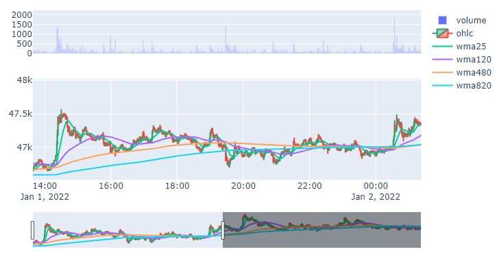

## Table of Contents

- [plotly](#1)

---

## #1

### plotly
- interactive한 표현을 제공하는 파이썬 그래픽 라이브러리
- 줌인, 줌아웃 등의 동작을 비교적 쉽게 구현 가능
- 주가 백테스팅할 경우 많이 사용
- 너무 많은 데이터를 시각화하면 오래걸림(아래 예시에서는 주식 데이터에서 1분봉 기준으로 하루치만 시각화)
- 예시 코드1
    ```python
    import plotly.graph_objects as go
    from plotly.subplots import make_subplots

    df_org_split = df_org[:1440]

    fig=make_subplots(rows=2, cols=1, shared_xaxes=True, row_heights=[0.3,0.7])

    candle = go.Candlestick(name ='ohlc',
                            x=df_org_split['datetime'],
                            open=df_org_split['open'],
                            high=df_org_split['high'],
                            low=df_org_split['low'],
                            close=df_org_split['close'])

    wma25 = go.Scatter(name ='wma25',x=df_org_split['datetime'], y=df_org_split['wma25'])
    wma120 = go.Scatter(name ='wma120',x=df_org_split['datetime'], y=df_org_split['wma120'])
    wma480 = go.Scatter(name ='wma480',x=df_org_split['datetime'], y=df_org_split['wma480'])
    wma820 = go.Scatter(name ='wma820',x=df_org_split['datetime'], y=df_org_split['wma820'])

    volume = go.Bar(name='volume',
                    x=df_org_split['datetime'],
                    y=df_org_split['volume'])

    fig.add_trace(volume,row=1,col=1)
    fig.add_trace(candle,row=2,col=1)

    fig.add_trace(wma25,row=2,col=1)
    fig.add_trace(wma120,row=2,col=1)
    fig.add_trace(wma480,row=2,col=1)
    fig.add_trace(wma820,row=2,col=1)

    fig.show()
    ```    
        
- 예시 코드2
    - 매수 매도 시점을 표시하기 위한 add_annotation 추가
    - 간단한 예시로 종가가 wma25보다 높아지는 경우는 U, 떨어지는 경우는 D 표시
    - pandas DataFrame에서 데이터 조작이 필요
        ```python
        # 종가가 wma 25 올라가거나 내려가는 경우 체크해주기 (종가가 wma25보다 높다면 True, 아니면 False)
        df_org_test = df_org
        df_org_test['check']= df_org_test['close']>=df_org_test['wma25']
        ```
        ```python
        # check가 True -> False된 경우는 Down, False -> True된 경우는 Up
        # 비교를 하기 위하여 check를 한칸씩 앞으로 내린 값 행을 추가 생성
        # 
        df_org_test['check_2']=df_org_test['check'].shift(1).fillna(0)

        def get_up_down(df):
            if df['check']==True and df['check_2']==False:
                ans = 'Up'
            elif df['check']==False and df['check_2']==True:
                ans = 'Down'
            else:
                ans = 'same'
            return ans
        
        df_org_test['check_3']= df_org_test.transpose().apply(lambda x:get_up_down(x))
        ```
    - 실제 코드
        ```python
        import plotly.graph_objects as go
        from plotly.subplots import make_subplots

        df_org_split = df_org[:1440]

        fig=make_subplots(rows=2, cols=1, shared_xaxes=True, row_heights=[0.3,0.7])

        candle = go.Candlestick(name ='ohlc',
                                x=df_org_split['datetime'],
                                open=df_org_split['open'],
                                high=df_org_split['high'],
                                low=df_org_split['low'],
                                close=df_org_split['close'])

        wma25 = go.Scatter(name ='wma25',x=df_org_split['datetime'], y=df_org_split['wma25'])
        wma120 = go.Scatter(name ='wma120',x=df_org_split['datetime'], y=df_org_split['wma120'])
        wma480 = go.Scatter(name ='wma480',x=df_org_split['datetime'], y=df_org_split['wma480'])
        wma820 = go.Scatter(name ='wma820',x=df_org_split['datetime'], y=df_org_split['wma820'])

        volume = go.Bar(name='volume',
                        x=df_org_split['datetime'],
                        y=df_org_split['volume'])

        fig.add_trace(volume,row=1,col=1)
        fig.add_trace(candle,row=2,col=1)

        fig.add_trace(wma25,row=2,col=1)
        fig.add_trace(wma120,row=2,col=1)
        fig.add_trace(wma480,row=2,col=1)
        fig.add_trace(wma820,row=2,col=1)

        # 구매한 시점의 가격 표시
        for idx in df_org_test.index[:1440]:
            if df_org_test.loc[idx,'check_3']=='Up':
                fig.add_annotation(
                        x=df_org_test.loc[idx,'datetime'],
                        y=df_org_test.loc[idx,'close'],
                        text='U',row=2,col=1
                        )
            elif df_org_test.loc[idx,'check_3']=='Down':
                fig.add_annotation(
                        x=df_org_test.loc[idx,'datetime'],
                        y=df_org_test.loc[idx,'close'],
                        text='D',row=2,col=1
                        )        

        fig.show()
        ```    
            

#### References
- https://plotly.com/python/