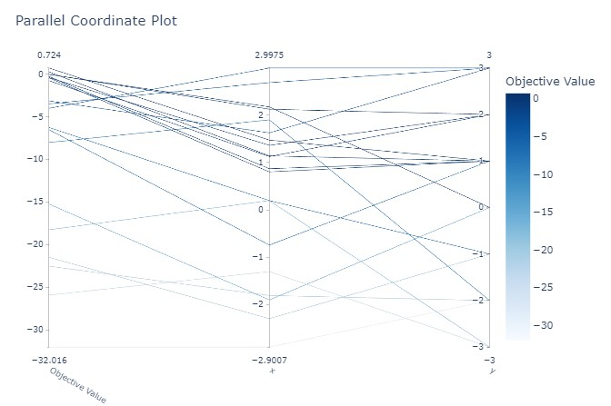
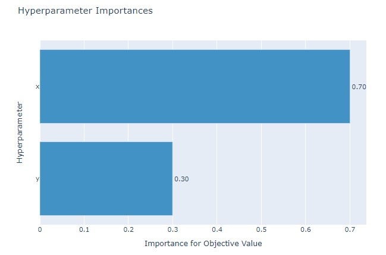

## Table of Contents

- [optuna](#1)

---

## #1

### optuna
- 설치 : `pip install optuna`
- 기본 구조
    ```python
    import optuna

    def objective(trial):
        x = trial.suggest_float('x',-3,3)
        y = trial.suggest_int('y',-3,3)
        return -(x-2) ** 2 - (y - 1) ** 2 + 1

    study = optuna.create_study(direction='maximize') # sampler = TPESampler 이런식으로 sampler 지정가능 , direction = 'minimize' 도  가능
    study.optimize(objective, n_trials=20)
    print(study.best_trial.value, study.best_trial.params)
    '''
    [I 2023-01-29 04:23:40,150] Trial 0 finished with value: -6.2559929221266914 and parameters: {'x': 0.19556299025798873, 'y': -1}. Best is trial 0 with value: -6.2559929221266914.
    [I 2023-01-29 04:23:40,150] Trial 1 finished with value: -6.528396406434873 and parameters: {'x': -0.7437923402536994, 'y': 1}. Best is trial 0 with value: -6.2559929221266914.
    [I 2023-01-29 04:23:40,151] Trial 2 finished with value: -18.254515535653564 and parameters: {'x': 0.19597241272380694, 'y': -3}. Best is trial 0 with value: -6.2559929221266914.
    ...
    [I 2023-01-29 04:23:40,195] Trial 16 finished with value: -0.43585755490991795 and parameters: {'x': 0.8017272618848754, 'y': 1}. Best is trial 7 with value: 0.7236308702683221.
    [I 2023-01-29 04:23:40,201] Trial 17 finished with value: -0.030837548803892556 and parameters: {'x': 2.1756062322467304, 'y': 0}. Best is trial 7 with value: 0.7236308702683221.
    [I 2023-01-29 04:23:40,205] Trial 18 finished with value: -0.763923267538597 and parameters: {'x': 1.1259729594923296, 'y': 2}. Best is trial 7 with value: 0.7236308702683221.
    [I 2023-01-29 04:23:40,211] Trial 19 finished with value: -0.016174049286330705 and parameters: {'x': 2.1271772357237357, 'y': 2}. Best is trial 7 with value: 0.7236308702683221.
    0.7236308702683221 {'x': 1.4742917827048183, 'y': 1}
    '''
    ```
- 파라미터 세팅
    - suggest_float(name, low, high, *[, step, log]) : 실수
    - suggest_int(name, low, high[, step, log]) : 정수
    - suggest_categorical() : 원하는 카테고리

    ```python
    'momentum' : trial.suggest_uniform('momentum', 0.1, 0.99),
    'n_epochs' : trial.suggest_int('n_epochs', 3, 5, 1), #3~5 에폭, step은 1 
    'optimizer': trial.suggest_categorical('optimizer',[optim.SGD, optim.Adam]),
    ```

- sampler 종류
    - None(default value) 으로 설정되어져 있으면 BaseSampler 가 적용됨
    - BaseSampler : https://optuna.readthedocs.io/en/stable/reference/samplers/generated/optuna.samplers.BaseSampler.html#optuna.samplers.BaseSampler 참고 , 나머지 sampler들은 BaseSampler로부터 파생된것임

- 시각화 예시
    - 파라미터들관의 관계
        ```python
        import optuna

        def objective(trial):
            x = trial.suggest_float('x',-3,3)
            y = trial.suggest_int('y',-3,3)
            return -(x-2) ** 2 - (y - 1) ** 2 + 1

        study = optuna.create_study(sampler=None, direction='maximize')
        study.optimize(objective, n_trials=20)

        optuna.visualization.plot_parallel_coordinate(study)
        ```    
            
    - 파라미터 중요도
        ```python
        optuna.visualization.plot_param_importances(study)
        ```    
            
        
#### References
- https://optuna.readthedocs.io/en/stable/
- https://dacon.io/codeshare/2704