## Table of Contents

- [view 와 reshape의 차이 (cf. flatten,contiguous,clone)](#1)
- [가중치 초기화(weight init)](#2)
- [Batch Norm과 Layer Norm](#3)

---

## #1

### view 와 reshape의 차이 (cf. flatten,contiguous,clone)
- 우선적으로 contiguous 개념을 알아야함
    - contiguous : contiguous란 matrix의 순차적인 shape information과 실제 matrix의 각 데이터가 저장된 위치가 같은지 여부를 말함
    - contigous가 False가 되는 가장 대표적인 예시로 transpose 시킬 경우 contiguous가 False가 됨
    - 만약 RuntimeError : input is not contiguous 하다고 나올경우 input = input.contiguous()를 통해 변경후 사용가능
    - 코드
        ```python
        a = torch.randn(4,3,2)
        print(a.is_contiguous())
        print(a.size())
        '''
        True
        torch.Size([4, 3, 2])
        '''
        ```
        ```python
        b = a.transpose(1,2)
        print(b.is_contiguous())
        print(b.size())
        '''
        False
        torch.Size([4, 2, 3])
        '''
        ```
- view vs reshape(flatten)
    - flatten은 reshape 기반으로 작성된것이므로 reshape으로 코드를 사용해도 됨
    - view는 contiguous하지 못한 데이터에는 적용 불가(.contiguous().view() 를 통해 강제적으로 적용가능)
    - reshape은 contiguous 한 데이터는 view와 똑같은 기능을 수행하지만 view와는 다르게 contiguous하지 못한 데이터가 들어오더라도 그 데이터를 알아서 contiguous하게 변경후 view 시켜줌
    - 여기서 주의할 점이 view나 contiguous한 데이터에 reshape 적용하는경우 데이터를 공유하게 됨 ( 하지만 view에 contiguous를 적용해주거나, contiguous하지 않은 데이터에 reshape을 적용한 경우는 데이터를 공유하지 않게 됨 )
        - reshape과 view이 데이터를 공유하는 경우(contigous()가 적용되지 않은 경우)
            ```python
            z = torch.zeros(3,2)
            y = z.reshape(6)
            z.fill_(1)
            print(y)
            print(z)
            '''
            tensor([1., 1., 1., 1., 1., 1.])
            tensor([[1., 1.],
                    [1., 1.],
                    [1., 1.]])
            '''
            ```
            ```python
            z = torch.zeros(3,2)
            y = z.reshape(6)
            y.fill_(1)
            print(y)
            print(z)
            '''
            tensor([1., 1., 1., 1., 1., 1.])
            tensor([[1., 1.],
                    [1., 1.],
                    [1., 1.]])
            '''
            ```
            ```python
            z = torch.zeros(3,2)
            y = z.view(6)
            z.fill_(1)
            print(y)
            print(z)
            '''
            tensor([1., 1., 1., 1., 1., 1.])
            tensor([[1., 1.],
                    [1., 1.],
                    [1., 1.]])
            '''
            ```
            ```python
            z = torch.zeros(3,2)
            y = z.view(6)
            y.fill_(1)
            print(y)
            print(z)
            '''
            tensor([1., 1., 1., 1., 1., 1.])
            tensor([[1., 1.],
                    [1., 1.],
                    [1., 1.]])
            '''
            ```
        - 데이터를 공유하지 않는 경우 (contiguous()가 적용된 경우, 단, 그전 데이터가 contiguous하지 않아야지만 contiguous가 적용이 됨)
            ```python
            z = torch.zeros(3,2)
            y = z.contiguous().view(6)
            z.fill_(1)
            print(y)
            print(z)
            '''
            tensor([1., 1., 1., 1., 1., 1.])
            tensor([[1., 1.],
                    [1., 1.],
                    [1., 1.]])
            '''
            ```
            (contiguous한 데이터에 contiguous를 적용하면 아무런 변화가 없음(즉 데이터를 공유함))
            ```python
            z = torch.zeros(3,2).transpose(0,1)
            y = z.contiguous().view(6)
            z.fill_(1)
            print(y)
            print(z)
            '''
            tensor([0., 0., 0., 0., 0., 0.])
            tensor([[1., 1., 1.],
                    [1., 1., 1.]])
            '''
            ```
            (contiguous 하지 않은 데이터에 contiguous를 적용하니까 데이터를 공유하지 않는것을 확인할 수 있음)
            ```python
            z = torch.zeros(3,2)
            y = z.reshape(6)
            z.fill_(1)
            print(y)
            print(z)
            '''
            tensor([1., 1., 1., 1., 1., 1.])
            tensor([[1., 1.],
                    [1., 1.],
                    [1., 1.]])
            '''
            ```
            (contiguous한 데이터에 reshape이 적용되었으므로 contiguous()가 적용되지 않음 따라서 데이터를 공유하게 됨)
            ```python
            z = torch.zeros(3,2).transpose(0,1)
            y = z.reshape(6)
            z.fill_(1)
            print(y)
            print(z)
            '''
            tensor([0., 0., 0., 0., 0., 0.])
            tensor([[1., 1., 1.],
                    [1., 1., 1.]])
            '''
            ```
            (contiguous하지 않은 데이터에 reshape이 적용되면 contiguous()가 자동으로 적용되어서 데이터를 공유하지 않게 됨)
        - 참고 : contiguous 한지 고려하지 않고 무조건으로 데이터를 공유하지 않고 싶다면 clone을 통해 복사하여 사용하면됨
            ```python
            z = torch.zeros(3,2)
            y = z.clone().reshape(6)
            z.fill_(1)
            print(y)
            print(z)
            '''
            tensor([0., 0., 0., 0., 0., 0.])
            tensor([[1., 1.],
                    [1., 1.],
                    [1., 1.]])
            '''
            ```
            ```python
            z = torch.zeros(3,2)
            y = z.clone().view(6)
            z.fill_(1)
            print(y)
            print(z)
            '''
            tensor([0., 0., 0., 0., 0., 0.])
            tensor([[1., 1.],
                    [1., 1.],
                    [1., 1.]])
            '''
            ```

    - 결론 : .contiguous().view() 와 .reshape() 완전히 동일한 기능을 수행하게 됨. reshape()이 더 강력한 기능을 하기 때문에 reshape을 사용하는 것을 추천
    
#### References
- https://jimmy-ai.tistory.com/122

---

## #2

### 가중치 초기화(weight init)
- 가중치 초기화 이론
    - 가중치 초기값이 0이거나 동일한 경우
        - 가중치의 초기값을 모두 0으로 초기화하거나 동일한 값으로 초기화할 경우 모든 뉴런의 동일한 출력값을 내보낼것임. 이럴 경우 역전파에서 각 뉴런이 모두 동일한 그래디언트 값을 가지게 됨(이럴 경우 뉴런의 개수가 아무리 많아도 뉴런이 하나뿐인 것처럼 작동하기 때문에 학습이 제대로 이루어지지 않음)
        - 따라서 가중치 초기값을 동일한 값으로 초기화 해서는 안됨.
    - 작은 난수
        - 가중치 초기값은 작은 값으로 초기화 해야하는데, 그 이유는 활성화 함수가 sigmoid일 경우 가중치 초기값을 절대값이 큰 값으로 한다면 0과 1로 수렴하기 때문에 그래디언트 소실이 발생함. 또한 ReLu일 경우도 절대값이 클 경우 음수일 때는 dead ReLU 문제가 발생하고, 양수일 때는 그래디언트가 폭주하게 됨.
        - 따라서 가중치 초기값을 작게 초기화 해야하며 동일한 초기값을 가지지 않도록 랜덤하게 초기화 해야함
        - 일반적으로 가중치 초기값은 평균이 0이고 표준편차가 0.01인 정규 분포를 따르는 값으로 랜덤하게 초기화함
        - 하지만 이러한 가중치 초기화 방법은 얕은 신경망에서만 괜찮게 작동할지 모르지만, 신경망의 깊이가 깊어질수록 문제가 발생하게 됨. 
            - 예를 들어 평균이 0 이고 표준편차가 0.01 정규분포를 따르는 값으로 랜덤하게 초기화하고 tanh를 활성화 함수로 사용하게 되면 첫번째 hidden layer를 제외한 나머지 레이어들이 모두 0을 출력하게 됨(학습이 이루어지지 않게 됨)    
                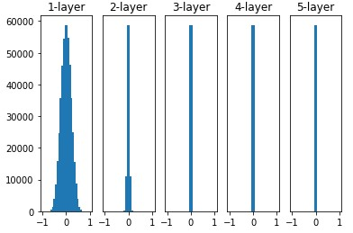
            - 또한 평균이 0 이고 표준편차가 1인 정규 분포를 따르는 값으로 랜덤하게 초기화하고 tanh를 활성화 함수로 사용하였을 경우 아래의 그림처럼 tanh의 출력이 -1과 1로 집중되면서 그래디언트 소실 문제가 발생함.    
                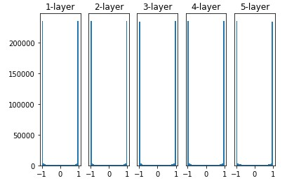
    - Xavier 초기화
        - 입출력 레이어의 개수 고려    
            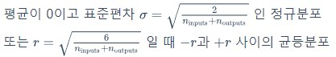
        - tanh 활성화 함수에 xavier 초기값 설정    
            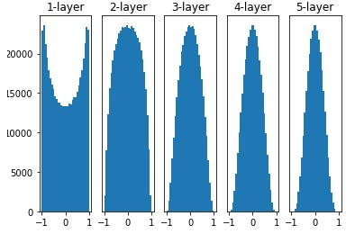
        - ReLU 활성화 함수에 xavier 초기값 설정 -> 레이어가 깊어질수록 출력값이 0으로 치우치는 문제 발생    
            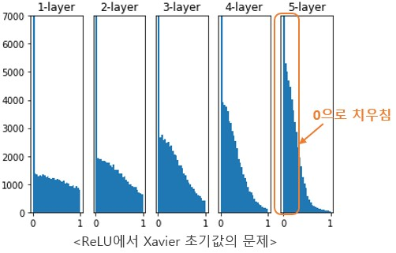
    - He 초기화
        - Xavier의 ReLU 활성화 함수에서의 문제를 해결한것    
            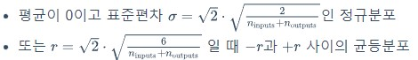
            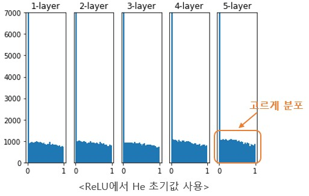
    - 결론
        - 활성화 함수로는 ReLU를 먼저 사용하는 것이 좋음
        - 가중치 초기화는 Sigmoid일 경우 Xavier, ReLU일 경우 He 초기값을 사용하는 것이 좋음
- 다양한 초기화 방법
    - `torch.nn.init.constant_(tensor, val)` : 상수로 설정
    - `torch.nn.init.unifiom_(tensor, a=0.0, b=1.0)` : a부터 b사이의 값을 균일한 분포로 설정. 디폴트 설정은 a=0.0, b=1.0
    - `torch.nn.init.normal_(tensor, mean=0.0, std=1.0)` : 평균이 0이고 표준편차가 1인 분포로 설정
    - Xavier(= Glorot initialization)
        - 기존의 무작위 수로 초기화와 다르게 layer의 특성에 맞춰서 초기화 하는 방법
        - `torch.nn.init.xavier_uniform_(tensor, gain=1.0)`
        - `torch.nn.init.xavier_normal_(tensor, gain=1.0)`
    - Kaiming(= He-initialization)
        - relu나 leaky_relu를 activation function으로 사용하는 경우 많이 사용함
        - `torch.nn.init.kaiming_uniform_(tensor, a=0, mode='fan_in', nonlinearity='leaky_relu')`
        - `torch.nn.init.kaiming_normal_(tensor, a=0, mode='fan_in', nonlinearity='leaky_relu')`
- 일반적으로 아래 방식 사용
    ```python
    # 모든 neural network module, nn.Linear, nn.Conv2d, BatchNorm, Loss function 등.
    import torch.nn as nn 
    # 파라미터가 없는 함수들 모음
    import torch.nn.functional as F 

    class CNN(nn.Module):
        def __init__(self, in_channels, num_classes):
            super(CNN, self).__init__()
            self.conv1 = nn.Conv2d(
                    in_channels=in_channels,
                    out_channels=6,
                    kernel_size=(3,3),
                    stride=(1,1),
                    padding=(1,1)
            )
            self.pool = nn.MaxPool2d(kernel_size=(2,2), stride = (2,2))
            self.conv2 = nn.Conv2d(
                    in_channels=6,
                    out_channels=16,
                    kernel_size=(3,3),
                    stride=(1,1),
                    padding=(1,1)
            )
            self.fc1 = nn.Linear(16*7*7, num_classes)
            # 예제의 핵심인 initialize_weights()로 __init__()이 호출될 때 실행됩니다.
            self.initialize_weights()

        def forward(self, x):
            x = F.relu(self.conv1(x))
            x = self.pool(x)
            x = F.relu(self.conv2(x))
            x = self.pool(x)
            x = x.reshape(x.shape[0], -1)
            x = self.fc1(x)
            
            return x
        
        # 각 지정된 연산(Conv2d, BatchNorm2d, Linear)에 따라 각기 다른 초기화를 줄 수 있습니다.
        def initialize_weights(self):
            for m in self.modules():
                # convolution kernel의 weight를 He initialization을 적용한다.
                if isinstance(m, nn.Conv2d):
                    nn.init.kaiming_uniform_(m.weight)
                    
                    # bias는 상수 0으로 초기화 한다.
                    if m.bias is not None:
                        nn.init.constant_(m.bias, 0)
                
                elif isinstance(m, nn.BatchNorm2d):
                    nn.init.constant_(m.weight, 1)
                    nn.init.constant_(m.bias, 0)
            
                elif isinstance(m, nn.Linear):
                    nn.init.kaiming_uniform_(m.weight)
                    nn.init.constant_(m.bias, 0)

            
    if __name__ == '__main__':
        model = CNN(in_channels=3,num_classes=10)
        
        # He initialization과 Constant로 초기화 한것을 확인할 수 있습니다.
        for param in model.parameters():
            print(param)
    ```
- 간단한 예시 코드
    ```python
    class Custom_Net(nn.Module):
        def __init__(self):
            super(Custom_Net, self).__init__()

            self.linear_1 = nn.Linear(1024, 1024, bias=False)
            
            # model.modules()-> generator / for 문 사용하면 
            # Custom_Net((linear_1): Linear(in_features=1024, out_features=1024, bias=False))
            # Linear(in_features=1024, out_features=1024, bias=False)
            for m in self.modules(): 
                if isinstance(m, nn.Linear):
                    torch.nn.init.normal_(m.weight,mean=0,std=1) # m.weight.data = m.weight

    model = Custom_Net()

    for param in model.parameters():
        print(param)
        print(param.mean())
        print(param.std())
    '''
    Parameter containing:
    tensor([[ 0.0336, -0.3054, -0.5625,  ..., -0.8603,  0.3355, -0.1826],
            [ 0.3902, -0.1708, -0.2713,  ..., -0.5215,  0.7843, -1.2075],
            [-0.5171,  0.6536,  0.7110,  ...,  0.1070,  0.3790,  0.3462],
            ...,
            [ 0.2072, -0.7820, -0.5950,  ...,  1.6191,  0.2633,  0.2891],
            [-0.2336,  0.9174, -0.7213,  ...,  1.3410,  0.2403,  0.4809],
            [ 0.0212, -0.5089,  0.2311,  ..., -0.1621,  0.3824, -0.5731]],
        requires_grad=True)
    tensor(0.0010, grad_fn=<MeanBackward0>)
    tensor(0.9997, grad_fn=<StdBackward0>)
    '''
    ```

- 다른 대표적으로 사용하는 초기화 방법(이것만 적용해도 어느정도 커버 가능)
    ```python
    def initialize_weights(m):
        if hasattr(m, 'weight') and m.weight.dim() > 1: # m.weight.dim()는 shape의 차원수 즉 torch.size([1024,1024])-> 2,torch.Size([20,100,20,20])-> 4
            nn.init.kaiming_uniform_(m.weight.data)
        if hasattr(m,'bias') and m.bias is not None: # bias가 False일 경우는 None으로 나옴
            nn.init.constant_(m.bias, 0)

    model = Transformer().to(device)

    # model.apply를 하게되면 함수의 인자로 module이 들어가게됨
    model.apply(initialize_weights)
    ```
    ```python
    class Custom_Net(nn.Module):
        def __init__(self):
            super(Custom_Net, self).__init__()

            self.linear_1 = nn.Linear(1024, 1024, bias=False)
            self.cnn = nn.Conv2d(100,20,20)
            
            self.embedding = nn.Embedding(100,20)
    model = Custom_Net().to(device)

    def initialize_weights(m):
        if hasattr(m, 'weight') and m.weight.dim() > 1: # m.weight.dim()는 shape의 차원수 즉 torch.size([1024,1024])-> 2,torch.Size([20,100,20,20])-> 4
            nn.init.kaiming_uniform_(m.weight.data,nonlinearity='leaky_relu')
        if hasattr(m,'bias') and m.bias is not None: # bias가 False일 경우는 None으로 나옴
            nn.init.constant_(m.bias, 0)

    model.apply(initialize_weights)
    ```

- 정리본
    ```python
    def initialize_weights(m):
        # convolution kernel의 weight를 He initialization을 적용한다.
        if isinstance(m, nn.Conv2d):
            nn.init.kaiming_uniform_(m.weight.data,nonlinearity='leaky_relu')

            # bias는 상수 0으로 초기화 한다.
            if m.bias is not None:
                nn.init.constant_(m.bias, 0)

        elif isinstance(m, nn.BatchNorm2d):
            nn.init.constant_(m.weight, 1)
            nn.init.constant_(m.bias, 0)

        elif isinstance(m, nn.Linear):
            nn.init.kaiming_uniform_(m.weight.data,nonlinearity='leaky_relu')
            
            # bias는 상수 0으로 초기화 한다.
            if m.bias is not None:
                nn.init.constant_(m.bias, 0)

            
    model = Custom_Net().to(device)
    model.apply(initialize_weights)
    ```
    - layernorm : weight = 1 bias = 0으로 초기화 되어있음 (https://pytorch.org/docs/stable/generated/torch.nn.LayerNorm.html)
    - Embedding : 평균0, 표준편차 1로 초기화 되어져있음 (https://pytorch.org/docs/stable/generated/torch.nn.Embedding.html)
    - BatchNorm2d는 초기값이 torch에 정의되어져 있지 않음 (https://pytorch.org/docs/stable/generated/torch.nn.BatchNorm2d.html)
    - Conv2d : He 초기화 되어져 있음
    - Linear : He 초기화 되어져 있음
    - embedding과 
#### References
- https://freshrimpsushi.github.io/posts/weights-initialization-in-pytorch/
- https://gaussian37.github.io/dl-pytorch-snippets/#weight-%EC%B4%88%EA%B8%B0%ED%99%94-%EB%B0%A9%EB%B2%95-1
- https://supermemi.tistory.com/121
- https://excelsior-cjh.tistory.com/177
- https://pytorch.org/docs/stable/nn.init.html#torch.nn.init.kaiming_uniform_

---

## #3

### Batch Norm과 Layer Norm
- 그림을 통한 이해    
    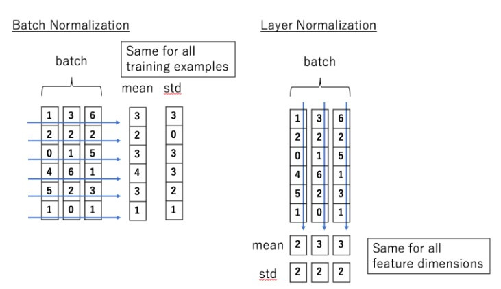    
- Batch Norm과 Layer Norm의 간단한 설명
    - Batch Norm 
        - 채널별로 배치를 묶어 평균이 0 표준편차를 1로 정규화. 
        - (Batch,Channel,H,W)일경우 Batch,H,W의 평균이 0 표준편차를 1로 만드는 것. 
        - 감마와 베타의 shape은 (Channel)와 같음 (nn.BatchNorm1d 나 2d의 코드를 보게되면 입력인자가 channel만 들어감 즉 감마와 베타를 channel shape을 가지는 벡터만 만드는것).
        - 즉 채널별로 (batch,h,w)의 평균이 0 분산이 1로 만들었는데 이것을 얼마만큼씩 scale,bias를 적용해줄지를 감마와 베타가 정해주는것 (이미지의 경우 채널별로 이미지에 대해 배치사이즈로 묶어준 것들의 평균과 분산을 구해준후 적절하게 채널별로 감마와 베타로 scale, bias 해주는 것)    
        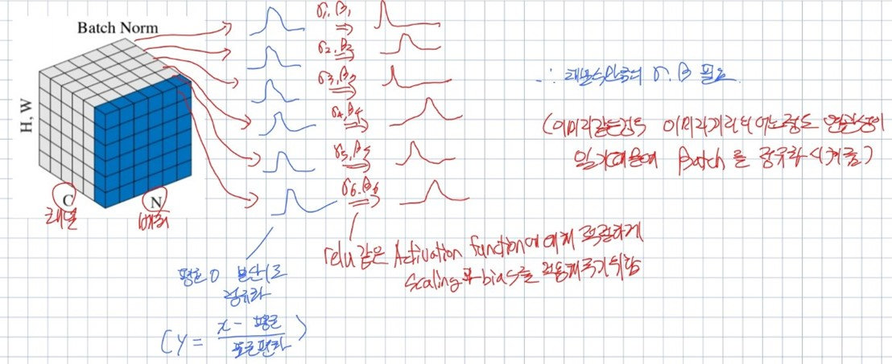    
    - Layer Norm 
        - 배치별로 layer를 묶어 평균이 0 표준편차를 1로 정규화.
        - (Batch,Channel,H,W)일경우 Channle,H,W의 평균이 0 표준편차를 1로 만드는 것. 
        - 감마와 베타의 shape은 (Channle,H,W)와 같음 (nn.LayerNorm코드를 보면 입력인자가 여러개의 차원이 들어감. 즉 감마와 벡타도 그 shape에 맞게 생성됨)
        - 즉, 이미지에 대한 경우는 모든 이미지에 대해 각각 이미지를 평균0 표준편차1로 어느정도 안정화된 값으로 만든다음에 모든 이미지의 같은 위치의 모든채널안에서의 픽셀마다(즉, (0,0,0) 이라면 0번째 채널의 0,0의 픽셀 끼리의 이미지의 관계,(1,10,30) 이라면 1번재 채널의 10,30 픽셀에서 모든 이미지의 관계) 감마와 베타를 학습해 그 위치에서는 어떤 scale, bias가 좋은지를 적용시켜줌(이럴 경우 각각의 픽셀위치가 어떤 역할을 하는지 어느정도 의미를 파악가능. 사실 이미지에서는 픽셀위치가 그렇게 유의미한 경우가 없기 때문에 이미지에서는 Batch Norm을 많이 사용)    
            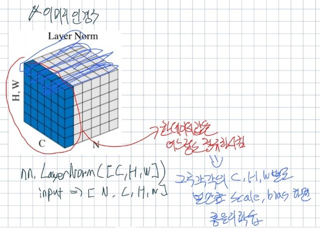    
        - NLP에 대한 경우도 마찬가지임 NLP는 보통 (Batch,Length,embedding)인 경우가 많은데 nn.LayerNorm에 embedding 1차원만 들어가는 경우가 대부분임. 이럴 경우는 전체 Length에 대해서 각각의 단어 임베딩차원 값들을 평균 0 표준편차 1로 만들어준다음에 각각의 임베딩 차원에서(즉, embedding이 5차원일 경우 전체 length 문장에서 각 단어마다 1번째 차원끼리의 상관관계, 2번재 차원끼리의 상관관계 , ... 5번재 차원끼리의 상관관계를 감마 베타가 학습하는것) 전체 단어에 대해 각각의 차원의 상관관계를 감마 베타가 구해줌(이럴 경우 각각의 임베딩차원이 어떤 역할을 하는지 어느정도 더 정확하게 설정가능해짐)    
            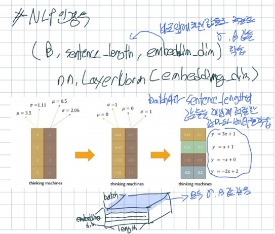     
    - Batch Norm 은 채널에 대한 감마와 베타의 벡터에 대해 파라미터를 학습하지만 , Layer Norm은 감마와 베타의 affine transform를 학습하는 것

- Batch Norm
    - nn.BatchNorm1d 와 nn.BatchNorm2d
        - nn.BatchNorm1d
            - input과 output
                - input : (N,C) or (N,C,L) (N : batch size, C : channels, L : sequence length)
                - output : (N,C) or (N,C,L)
            - 코드
                ```python
                # With Learnable Parameters
                m = nn.BatchNorm1d(100)

                # Without Learnable Parameters
                m = nn.BatchNorm1d(100, affine=False)
                input = torch.randn(20, 100)
                output = m(input)
                print(output.shape)
                '''
                torch.Size([20, 100])
                '''
                ```
        - nn.BatchNorm2d
            - input과 output
                - input : (N,C,H,W)
                - output : (N,C,H,W)
            - 코드
                ```python
                # With Learnable Parameters
                m = nn.BatchNorm2d(100)

                # Without Learnable Parameters
                m = nn.BatchNorm2d(100, affine=False)
                input = torch.randn(20, 100, 35, 45)
                output = m(input)
                print(output.shape)
                '''
                torch.Size([20, 100, 35, 45])
                '''
                ```
- Layer Norm
    - 대표적으로 NLP transformer에 존재
    - 코드를 통한 설명(NLP)
        - nn.LayerNorm 사용
            ```python
            # NLP Example
            batch, sentence_length, embedding_dim = 20, 50, 100
            embedding = torch.randn(batch, sentence_length, embedding_dim)
            layer_norm = nn.LayerNorm(embedding_dim)

            # Activate module
            output_1 = layer_norm(embedding)
            print(output_1.shape)
            '''
            torch.Size([20, 50, 100])
            '''
            ```
        - 직접 구현
            ```python
            class LayerNorm(nn.Module):
                def __init__(self, d_model, eps=1e-12):
                    super(LayerNorm, self).__init__()
                    self.gamma = nn.Parameter(torch.ones(d_model))
                    self.beta = nn.Parameter(torch.zeros(d_model))
                    self.eps = eps

                def forward(self, x):
                    mean = x.mean(-1, keepdim=True)
                    var = x.var(-1, unbiased=False, keepdim=True)
                    # '-1' means last dimension. 

                    out = (x - mean) / torch.sqrt(var + self.eps)
                    out = self.gamma * out + self.beta
                    return out

            batch, sentence_length, embedding_dim = 20, 50, 100
            embedding = torch.randn(batch, sentence_length, embedding_dim)
            layer_norm = LayerNorm(embedding_dim)
            # Activate module
            output_2 = layer_norm(embedding)
            print(output_2.shape)
            '''
            torch.Size([20, 50, 100])
            '''
            ```
        - 감마와 베타는 nn.LayerNorm에서 elementwise_affine이 True일 경우 학습되는 요소임(elementwise_affine의 default는 True)
        - 직접 구현한 코드를 보게 되면 nn.Parameter를 통해 선언해서 감마와 베타를 학습가능한 상수를 선언해줌
    - 코드를 통한 설명(Image)
        - nn.LayerNorm
            ```python
            # Image Example
            N, C, H, W = 20, 5, 10, 10
            input = torch.randn(N, C, H, W)
            # Normalize over the last three dimensions (i.e. the channel and spatial dimensions)
            # as shown in the image below
            layer_norm = nn.LayerNorm([C, H, W])
            output = layer_norm(input)
            print(output.shape)
            '''
            torch.Size([20, 5, 10, 10])
            '''
            ```
    - nn.LayerNorm 설명
        - 예를 들어, nn.LayerNorm에 들어가는 shape이 (3,5)(2차원 shape)일 경우, 평균과 표준편차는 input의 마지막 2차원으로 계산이 됨(예를 들면 input.mean((-2,-1))). 여기서 감마와 베타는 nn.LayerNorm에 들어가는 shape과 동일한 shape을 가짐(elementwise_affine이 True일 경우 학습되는 요소임(elementwise_affine의 default는 True))
        - 그림을 통한 이해    
            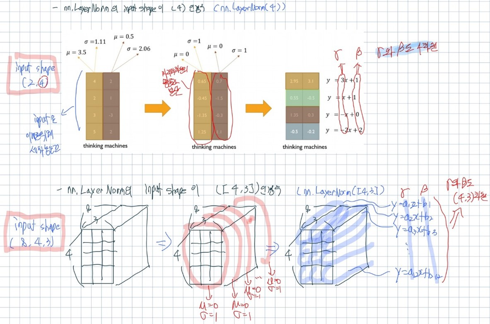    


#### References
- https://gaussian37.github.io/dl-concept-batchnorm/
- https://yonghyuc.wordpress.com/2020/03/04/batch-norm-vs-layer-norm/
- https://pytorch.org/docs/stable/generated/torch.nn.BatchNorm1d.html
- https://pytorch.org/docs/stable/generated/torch.nn.BatchNorm2d.html
- https://pytorch.org/docs/stable/generated/torch.nn.LayerNorm.html
- https://github.com/hyunwoongko/transformer